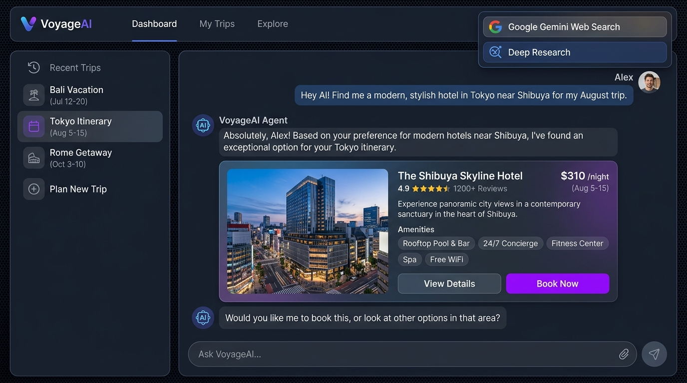

# 🌍 TravelAgent MVP - AI-Powered Travel Planning Platform

<p align="center">
  
</p>

<p align="center">
  <strong>An Intelligent Travel Planning Platform Powered by AI Agents and Microservices</strong>
</p>

<p align="center">
  
</p>

<p align="center">
  <a href="#-project-notice">Project Notice</a> •
  <a href="#-features">Features</a> •
  <a href="#-architecture">Architecture</a> •
  <a href="#-installation">Installation</a> •
  <a href="#-usage">Usage</a> •
  <a href="#-api-documentation">API Docs</a> •
  <a href="#-folder-structure">Folder Structure</a>
</p>

---

> [!WARNING]
> **Archived Project Notice:** This project was discontinued and became inactive over a year ago. As a result, some technologies, dependencies, and APIs may be outdated, deprecated, or no longer functioning. This repository is maintained strictly for archival, historical, and educational reference purposes, serving as an academic showcase of microservice architectures, AI Agent state machines, and RAG systems.

---

## 📋 Overview

**TravelAgent** is a personalized AI-powered travel planning platform designed to simplify trip research and hotel booking. The platform leverages advanced LLM workflows and semantic memory to tailor responses based on user preferences.

Key functionalities:
- 💬 **AI Conversational Agent**: Chat naturally to discover destinations, plan itineraries, and ask travel questions.
- 🏨 **Autonomous Booking Agent**: Assist users in finding, submitting, and confirming hotel accommodations.
- 🔍 **RAG Memory System**: Save and recall user preferences across sessions using semantic vectors.
- 🌐 **Real-time Web Search**: Fetch up-to-date travel information by integrating search API capabilities.
- 📚 **Deep Research**: Perform comprehensive, multi-source investigation on destinations.

---

## ✨ Features

### 🤖 AI-Powered Chat
- **General Travel Chat**: Powered by GPT-4o via GitHub Models to assist with general travel queries.
- **Web Search Integration**: Real-time travel search using Google Gemini API.
- **Deep Research**: In-depth multi-step research synthesizing information from multiple web resources.

### 🏨 Booking Agent
- Intelligent booking form with interactive data validation.
- Supports multiple lodging types (hotels, resorts, homestays, villas).
- Filtering by mandatory and optional amenities.
- Urgent and normal booking scheduling modes.
- Visual state updates for payment confirmations.

### 🧠 Semantic Memory (RAG)
- User preferences and past interactions stored as vector embeddings in **ChromaDB**.
- Automatic context retrieval based on semantic similarity to customize AI suggestions.

### 👥 User & Companion Management
- Secure user signup and login utilizing JWT Auth.
- Travel preference profiles.
- Companion lists for group travel synchronization.

---

## 🏗️ Architecture

### Tech Stack

| Layer | Technology |
|-------|------------|
| **Frontend** | React 18 + TypeScript + Vite + Ant Design 5 + Framer Motion |
| **Backend services** | Node.js + NestJS + TypeScript |
| **AI Orchestrator** | Express + TypeScript + Axios (custom SSE streams) |
| **AI Models** | Google Gemini API (Web Search) + GitHub Models (GPT-4o) |
| **Relational Database** | PostgreSQL 15 |
| **Caching & Message Broker** | Redis 7 |
| **Vector Database** | ChromaDB (RAG memory store) |

### Monorepo Structure

The project uses a monorepo workspace setup:
- `apps/web`: React SPA Client.
- `services/auth-service`: Authentication service handles JWT credentials.
- `services/user-service`: User profiles and traveler preferences.
- `services/trip-service`: Hotel booking management, itineraries, and transaction records.
- `services/ai-service`: Express-based gateway coordinating LLMs, vector memory, and Zalo integrations.
- `libs/common-types`: Core TypeScript shared types across the workspaces.
- `libs/sdk`: Shared code utilities and API client SDK.

### System Diagram

```
┌─────────────────────────────────────────────────────────────────┐
│                        Frontend (React)                         │
│                     http://localhost:3000                       │
└──────────────────────────────┬──────────────────────────────────┘
                               │
         ┌─────────────────────┼──────────────────────┐
         │                     │                      │
         ▼                     ▼                      ▼
┌───────────────┐    ┌─────────────────┐    ┌─────────────────┐
│  Auth Service │    │   AI Service    │    │  User Service   │
│   Port 3001   │    │   Port 3005     │    │   Port 3002     │
├───────────────┤    ├─────────────────┤    ├─────────────────┤
│ • JWT Tokens  │    │ • Chat Agent    │    │ • Profiles      │
│ • Signup/Login│    │ • Web Search    │    │ • Companions    │
│ • OAuth2      │    │ • Deep Research │    │ • Preferences   │
└───────┬───────┘    │ • Vector RAG    │    └────────┬────────┘
        │            └────────┬────────┘             │
        │                     │                      │
        ▼                     ▼                      ▼
┌─────────────────────────────────────────────────────────────────┐
│                        PostgreSQL + Redis                       │
│                       (Docker Containers)                       │
└─────────────────────────────────────────────────────────────────┘
                               │
                               ▼
                     ┌─────────────────┐
                     │    ChromaDB     │
                     │   Port 8000     │
                     │  (Vector Store) │
                     └─────────────────┘
```

---

## 🚀 Installation

### Prerequisites
- **Node.js** >= 18.0.0
- **npm** >= 9.0.0
- **Docker** and **Docker Compose**
- **Git**

### Step 1: Clone the repository
```bash
git clone <repository-url>
cd travel-agent-mvp
```

### Step 2: Install dependencies
Install all workspace dependencies from the root directory:
```bash
npm install
```

### Step 3: Configure Environment Variables
Create a root `.env` file from the example:
```bash
cp .env.example .env
```
Open `.env` and fill in the required credentials, especially the API keys:
- `GEMINI_API_KEY`: Google Gemini developer key.
- `GITHUB_TOKEN`: GitHub Personal Access Token (with `models:read` scope).

### Step 4: Start Infrastructure Containers
Launch PostgreSQL, Redis, and Elasticsearch using Docker Compose:
```bash
npm run docker:up
```
Verify the services are running:
```bash
docker-compose ps
```

### Step 5: Start ChromaDB
ChromaDB runs locally to store semantic user preferences. Launch it using:
```bash
cd services/ai-service
npx chroma run --path ./chroma_data --host localhost --port 8000
```

### Step 6: Run the Monorepo
Start all applications concurrently from the root directory:
```bash
npm run dev
```

Alternatively, run specific components:
- `npm run dev:web`: Frontend Client (http://localhost:3000)
- `npm run dev:auth`: Auth Microservice (http://localhost:3001)
- `npm run dev:user`: User Microservice (http://localhost:3002)
- `npm run dev:trip`: Trip & Booking Microservice (http://localhost:3003)
- `npm run dev:ai`: AI Agent gateway (http://localhost:3005)

---

## 🎯 Usage

### Local Ports Mapping

| Service / Port | URL | Description |
|----------------|-----|-------------|
| **Web Client** | http://localhost:3000 | React Application UI |
| **Auth API** | http://localhost:3001/api/docs | Auth Swagger Documentation |
| **User API** | http://localhost:3002/api/docs | User Swagger Documentation |
| **Trip API** | http://localhost:3003/api/docs | Trip Swagger Documentation |
| **AI Gateway** | http://localhost:3005 | Express REST & Event Streams |
| **ChromaDB** | http://localhost:8000 | Vector database instance |

### Core Workflows

1. **Authentication:**
   Navigate to `/login` to create an account or sign in. The web app uses localStorage to keep token signatures.
2. **AI Chat Interactions:**
   Open the Chat interface. Write queries to talk to the travel assistant. Toggle the **Web Search** or **Deep Research** badges for advanced capabilities.
3. **Initiate Accommodation Bookings:**
   Open the booking form from the sidebar, fill in your search parameters, and submit. The AI agent processes structured context to find best matches.

---

## 📚 API Documentation

### AI Service (Express)
```http
POST /api/chat/message          - Send chat message
POST /api/web-search            - Static search results
POST /api/web-search/stream     - Streamed web search using Gemini
POST /api/deep-research         - Multi-source search synthesis
POST /api/deep-research/stream  - Streaming deep research results
POST /api/booking/context       - Register hotel search parameters
POST /api/booking/query         - Prompt booking agent state machine
```

### Auth Service (NestJS)
```http
POST /auth/register            - Register a new account
POST /auth/login               - Authenticate credentials and get JWT
POST /auth/refresh             - Reissue token pairs
POST /auth/logout              - Invalidate current session tokens
GET  /auth/me                  - Retrieve active identity context
```

### User Service (NestJS)
```http
GET    /users/profile/:id      - Retrieve traveler profile
PUT    /users/profile/:id      - Modify user preferences
GET    /travel-companions      - List associated travel group companions
POST   /travel-companions      - Associate a new companion
DELETE /travel-companions/:id  - Remove companion association
```

---

## 🔧 Development Commands

Manage workspaces efficiently from the root directory:

```bash
# Start all microservices and web client concurrently
npm run dev

# Compile all workspaces (libs -> services -> apps/web)
npm run build

# Manage DB Migrations for TypeORM (in trip-service)
npm run db:migrate
npm run db:seed

# Spin infrastructure containers up or down
npm run docker:up
npm run docker:down

# Run all test configurations
npm run test
```

---

## 📁 Folder Structure

### Frontend (`apps/web/src`)
```
apps/web/src/
├── 📁 api/                  # Base API connections
├── 📁 components/           # UI React Components
│   ├── layout/              # Shared layouts
│   ├── ui/                  # Reusable form/boundary items
│   └── ChatPageContent.tsx  # Chat layout component
├── 📁 contexts/             # React Context stores (Auth, Theme)
├── 📁 hooks/                # Custom hooks (empty/reserved)
├── 📁 i18n/                 # Localization configurations
├── 📁 pages/                # Route pages (Dashboard, Admin, Profile)
├── 📁 services/             # API calls (auth, booking-api, deep-research)
├── 📁 store/                # Zustand / state controllers
├── 📁 styles/               # Global CSS files
├── 📁 types/                # TypeScript Interfaces (chat, auth, booking)
└── 📁 utils/                # Date and typography utils
```

### AI Service Gateway (`services/ai-service/src`)
```
services/ai-service/src/
├── 📁 controllers/          # Express route controllers
│   ├── booking-rag.controller.ts
│   ├── deep-research.controller.ts
│   └── web-search.controller.ts
├── 📁 services/             # Backend Business Logic
│   ├── azure-ai.service.ts
│   ├── booking-orchestrator.ts
│   ├── deep-research.service.ts
│   └── web-search.service.ts
├── 📁 rag/                  # Memory persistence logic
│   ├── memory.service.ts
│   └── vectorDb.ts          # ChromaDB connection
├── 📁 prompts/              # System travel prompts
└── index.ts                 # Main express entrypoint
```

---

## 🐛 Troubleshooting

### 1. Vector DB Connection Refused
If the AI service logs show connection errors to port `8000`:
- Double check if ChromaDB is launched. Ensure you ran `npx chroma run` inside `services/ai-service`.

### 2. NestJS Database Schema Out of Sync
If user or trip services fail to start due to missing Postgres tables:
- Ensure the Docker Postgres container is fully initialized.
- Run `npm run db:migrate` from the root directory to generate tables.

---

## 📄 License

Private - Internal Academic Archival Only.

---

<p align="center">
  Made with ❤️ by TravelAgent Team
</p>
