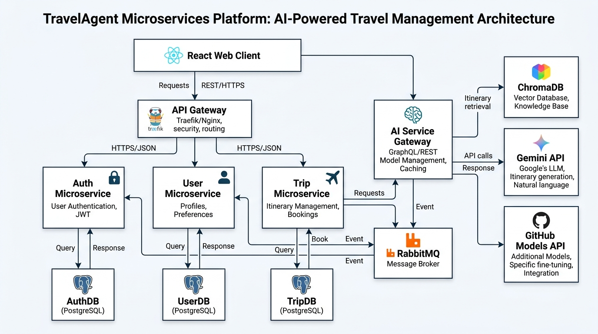

# TravelAgent MVP - Nền Tảng Lập Kế Hoạch Du Lịch Tích Hợp AI Agent

<p align="center">
  
</p>

<p align="center">
  <strong>Nền tảng lập kế hoạch du lịch thông minh sử dụng AI Agent và kiến trúc Microservices</strong>
</p>

<p align="center">
  <a href="#thông-báo-lưu-trữ">Thông Báo Lưu Trữ</a> •
  <a href="#tính-năng">Tính năng</a> •
  <a href="#kiến-trúc">Kiến trúc</a> •
  <a href="#cài-đặt">Cài đặt</a> •
  <a href="#sử-dụng">Sử dụng</a> •
  <a href="#tài-liệu-api">API Docs</a> •
  <a href="#cấu-trúc-thư-mục">Cấu trúc thư mục</a>
</p>

---

> [!WARNING]
> **Thông báo Dự án Lưu trữ:** Dự án này hiện đã dừng hoạt động cách đây 1 năm trước. Do đó, mọi công nghệ, thư viện liên kết và API sử dụng trong hệ thống này có thể đã lỗi thời hoặc không còn hoạt động. Mọi nỗ lực và tài nguyên hiện tại chỉ nhằm mục đích lưu trữ, nghiên cứu học thuật và tham khảo các phương pháp triển khai hệ thống Microservices, AI Agent và RAG (Retrieval-Augmented Generation).

---

## Tổng Quan

TravelAgent là nền tảng hỗ trợ lập kế hoạch du lịch cá nhân hóa tích hợp trí tuệ nhân tạo (AI), giúp người dùng đơn giản hóa việc tìm kiếm thông tin điểm đến và đặt phòng khách sạn. Hệ thống sử dụng các mô hình ngôn ngữ lớn (LLM) và bộ nhớ ngữ nghĩa để tối ưu hóa câu trả lời dựa trên sở thích của từng cá nhân.

Các chức năng chính:
- Trò chuyện cùng AI Agent: Trò chuyện tự nhiên để tìm kiếm địa điểm, lên lịch trình và đặt các câu hỏi du lịch.
- Autonomous Booking Agent: Tự động hỗ trợ người dùng tìm kiếm, đề xuất và xác nhận đặt phòng khách sạn.
- Bộ nhớ ngữ nghĩa (RAG): Lưu trữ và gợi nhớ sở thích của người dùng qua các phiên trò chuyện bằng Vector Database.
- Tìm kiếm Web thời gian thực: Tích hợp các API tìm kiếm để cập nhật tin tức du lịch, giá phòng mới nhất.
- Nghiên cứu chuyên sâu (Deep Research): Phân tích và tổng hợp thông tin đa nguồn về các địa điểm du lịch.

---

## Tính Năng

### AI Chat Thông Minh
- General Travel Chat: Trò chuyện thông thường về du lịch sử dụng GPT-4o qua GitHub Models.
- Web Search Integration: Cập nhật thông tin thực tế thời gian thực thông qua Google Gemini API.
- Deep Research: Tự động thực hiện các chuỗi tìm kiếm chuyên sâu và tổng hợp báo cáo chi tiết từ nhiều nguồn tài nguyên web.

### Trợ Lý Đặt Phòng (Booking Agent)
- Form đặt phòng trực quan với các cơ chế kiểm tra dữ liệu chặt chẽ.
- Hỗ trợ nhiều loại hình lưu trú (khách sạn, resort, homestay, villa).
- Lọc theo các tiện ích bắt buộc hoặc ưu tiên.
- Tùy chọn đặt phòng thường hoặc đặt khẩn cấp (Urgent).
- Hiển thị quy trình thanh toán và xác nhận đặt phòng theo thời gian thực.

### Bộ Nhớ Dựa Trên RAG (Semantic Memory)
- Lưu trữ sở thích cá nhân, lịch sử hành vi của người dùng thành các vector nhúng trong ChromaDB.
- Tự động recall context có độ tương đồng ngữ nghĩa cao để cá nhân hóa câu trả lời của AI.

### Quản Lý Thành Viên & Bạn Đồng Hành
- Cơ chế đăng ký, đăng nhập an toàn sử dụng JWT.
- Thiết lập thông tin cá nhân và sở thích du lịch.
- Quản lý danh sách bạn đồng hành để đồng bộ hóa kế hoạch du lịch nhóm.

---

## Kiến Trúc Hệ Thống

### Công Nghệ Sử Dụng (Tech Stack)

| Tầng (Layer) | Công nghệ |
|-------|------------|
| Frontend | React 18 + TypeScript + Vite + Ant Design 5 + Framer Motion |
| Backend Services | Node.js + NestJS + TypeScript |
| AI Orchestrator | Express + TypeScript + Axios (Custom SSE Streams) |
| AI Models | Google Gemini API (Web Search) + GitHub Models (GPT-4o) |
| Cơ sở dữ liệu | PostgreSQL 15 |
| Caching & Message Broker | Redis 7 |
| Vector Database | ChromaDB (Bộ nhớ RAG) |

### Cấu Trúc Monorepo

Dự án được tổ chức dưới dạng monorepo quản lý các workspaces:
- apps/web: Ứng dụng client React SPA.
- services/auth-service: Dịch vụ xác thực người dùng và cấp phát JWT.
- services/user-service: Quản lý thông tin hồ sơ và sở thích của khách hàng.
- services/trip-service: Quản lý thông tin đặt phòng khách sạn, chuyến đi và giao dịch.
- services/ai-service: Cổng kết nối AI, điều phối LLMs, bộ nhớ vector và các tích hợp bên thứ ba (Zalo).
- libs/common-types: Chứa các khai báo kiểu dữ liệu TypeScript dùng chung.
- libs/sdk: Bộ công cụ SDK và các client API nội bộ.

### Sơ Đồ Hệ Thống

<p align="center">
  
</p>

```
┌─────────────────────────────────────────────────────────────────┐
│                        Frontend (React)                         │
│                     http://localhost:3000                       │
└──────────────────────────────┬──────────────────────────────────┘
                               │
         ┌─────────────────────┼──────────────────────┐
         │                     │                      │
         ▼                     ▼                      ▼
┌───────────────┐    ┌─────────────────┐    ┌─────────────────┐
│  Auth Service │    │   AI Service    │    │  User Service   │
│   Port 3001   │    │   Port 3005     │    │   Port 3002     │
├───────────────┤    ├─────────────────┤    ├─────────────────┤
│ • JWT Tokens  │    │ • Chat Agent    │    │ • Profiles      │
│ • Đăng ký/nhập│    │ • Web Search    │    │ • Companions    │
│ • OAuth2      │    │ • Deep Research │    │ • Preferences   │
└───────┬───────┘    │ • Vector RAG    │    └────────┬────────┘
        │            └────────┬────────┘             │
        │                     │                      │
        ▼                     ▼                      ▼
┌─────────────────────────────────────────────────────────────────┐
│                        PostgreSQL + Redis                       │
│                       (Docker Containers)                       │
└─────────────────────────────────────────────────────────────────┘
                               │
                               ▼
                     ┌─────────────────┐
                     │    ChromaDB     │
                     │   Port 8000     │
                     │  (Vector Store) │
                     └─────────────────┘
```

---

## Hướng Dẫn Cài Đặt

### Yêu Cầu Hệ Thống
- Node.js >= 18.0.0
- npm >= 9.0.0
- Docker & Docker Compose
- Git

### Bước 1: Tải mã nguồn về máy
```bash
git clone <repository-url>
cd travel-agent-mvp
```

### Bước 2: Cài đặt thư viện liên kết
Chạy lệnh cài đặt từ thư mục root của dự án để thiết lập thư viện cho tất cả các workspaces:
```bash
npm install
```

### Bước 3: Cấu hình biến môi trường
Tạo file cấu hình môi trường .env từ file mẫu:
```bash
cp .env.example .env
```
Mở file .env lên và điền các thông tin bảo mật, đặc biệt là các khóa API:
- GEMINI_API_KEY: API Key lấy từ Google AI Studio.
- GITHUB_TOKEN: GitHub Personal Access Token (yêu cầu quyền models:read để gọi GPT-4o).

### Bước 4: Khởi động cơ sở dữ liệu và cơ sở hạ tầng
Chạy Docker Compose để khởi động các container PostgreSQL, Redis, Elasticsearch:
```bash
npm run docker:up
```
Kiểm tra trạng thái các service:
```bash
docker-compose ps
```

### Bước 5: Khởi động ChromaDB
ChromaDB đóng vai trò lưu trữ bộ nhớ ngữ nghĩa. Khởi động nó trên local:
```bash
cd services/ai-service
npx chroma run --path ./chroma_data --host localhost --port 8000
```

### Bước 6: Khởi chạy dự án
Chạy lệnh sau tại thư mục root để khởi chạy song song tất cả ứng dụng:
```bash
npm run dev
```

Nếu muốn khởi chạy riêng lẻ từng dịch vụ:
- npm run dev:web: Ứng dụng Client Frontend (http://localhost:3000)
- npm run dev:auth: Auth Service (http://localhost:3001)
- npm run dev:user: User Service (http://localhost:3002)
- npm run dev:trip: Trip Service (http://localhost:3003)
- npm run dev:ai: AI Service (http://localhost:3005)

---

## Sử Dụng

### Bản Đồ Cổng Kết Nối Local

| Dịch vụ / Cổng | URL | Mô tả |
|----------------|-----|-------------|
| Web Client | http://localhost:3000 | Giao diện React SPA |
| Auth API | http://localhost:3001/api/docs | Swagger Tài liệu Auth Service |
| User API | http://localhost:3002/api/docs | Swagger Tài liệu User Service |
| Trip API | http://localhost:3003/api/docs | Swagger Tài liệu Trip Service |
| AI Gateway | http://localhost:3005 | Express REST và luồng sự kiện (SSE) |
| ChromaDB | http://localhost:8000 | Vector Database cho bộ nhớ AI |

---

## Tài Liệu API

### AI Service (Express)
```http
POST /api/chat/message          - Gửi tin nhắn trò chuyện
POST /api/web-search            - Lấy kết quả tìm kiếm tĩnh
POST /api/web-search/stream     - Luồng kết quả tìm kiếm thời gian thực (Gemini)
POST /api/deep-research         - Nghiên cứu đa nguồn tĩnh
POST /api/deep-research/stream  - Luồng kết quả nghiên cứu chuyên sâu
POST /api/booking/context       - Khởi tạo thông tin đặt phòng
POST /api/booking/query         - Gửi lệnh đến State Machine của Booking Agent
```

### Auth Service (NestJS)
```http
POST /auth/register            - Đăng ký tài khoản mới
POST /auth/login               - Xác thực thông tin đăng nhập và lấy JWT
POST /auth/refresh             - Cấp lại token hết hạn
POST /auth/logout              - Hủy phiên đăng nhập hiện tại
GET  /auth/me                  - Lấy thông tin tài khoản hiện tại
```

### User Service (NestJS)
```http
GET    /users/profile/:id      - Lấy hồ sơ người dùng
PUT    /users/profile/:id      - Cập nhật sở thích du lịch
GET    /travel-companions      - Danh sách bạn đồng hành du lịch
POST   /travel-companions      - Thêm bạn đồng hành mới
DELETE /travel-companions/:id  - Xóa bạn đồng hành khỏi danh sách
```

---

## Các Lệnh Phát Triển

Bạn có thể quản lý nhanh dự án thông qua các lệnh script cấu hình tại file package.json ở root:

```bash
# Chạy song song tất cả các service và client web
npm run dev

# Biên dịch tất cả dự án (libs -> services -> apps/web)
npm run build

# Chạy Database Migrations cho TypeORM (trong trip-service)
npm run db:migrate
npm run db:seed

# Khởi động hoặc tắt hạ tầng Docker Containers
npm run docker:up
npm run docker:down

# Chạy toàn bộ các kịch bản kiểm thử
npm run test
```

---

## Cấu Trúc Thư Mục

### Frontend (apps/web/src)
```
apps/web/src/
├── api/                  # Khởi tạo kết nối API
├── components/           # Các UI Components React
│   ├── layout/              # Khung giao diện dùng chung
│   ├── ui/                  # Component nhỏ (nút, input, modal báo lỗi)
│   └── ChatPageContent.tsx  # Giao diện chính của màn hình chat
├── contexts/             # React Context (AuthContext, ThemeContext)
├── hooks/                # Custom React Hooks
├── i18n/                 # Cấu hình đa ngôn ngữ (Localization)
├── pages/                # Các trang route chính (Dashboard, Profile, Admin)
├── services/             # Logic API gọi lên Backend Services
├── store/                # Bộ quản lý state (Zustand)
├── styles/               # CSS global
├── types/                # Interfaces TypeScript dùng chung
└── utils/                # Hàm tiện ích (định dạng ngày, fonts)
```

### AI Service Gateway (services/ai-service/src)
```
services/ai-service/src/
├── controllers/          # Trình điều hướng API Express
│   ├── booking-rag.controller.ts
│   ├── deep-research.controller.ts
│   └── web-search.controller.ts
├── services/             # Logic nghiệp vụ AI
│   ├── azure-ai.service.ts
│   ├── booking-orchestrator.ts
│   ├── deep-research.service.ts
│   └── web-search.service.ts
├── rag/                  # Logic bộ nhớ vector ngữ nghĩa
│   ├── memory.service.ts
│   └── vectorDb.ts          # Kết nối ChromaDB
├── prompts/              # Các System Prompts điều phối AI
└── index.ts                 # File khởi chạy server Express
```

---

## Xử Lý Lỗi Thường Gặp (Troubleshooting)

### 1. Lỗi kết nối ChromaDB bị từ chối (Connection Refused)
Nếu console log của AI Service báo lỗi không thể kết nối cổng 8000:
- Hãy chắc chắn rằng bạn đã chạy lệnh npx chroma run bên trong thư mục services/ai-service.

### 2. NestJS Database Schema bị lỗi đồng bộ
Nếu dịch vụ user hoặc trip không thể hoạt động do thiếu bảng trong Postgres:
- Đảm bảo cơ sở dữ liệu PostgreSQL trong Docker đã được khởi chạy thành công.
- Thực hiện lệnh npm run db:migrate tại thư mục root để đồng bộ bảng.

---

## Bản Quyền

Private - Tài liệu lưu trữ nội bộ và học thuật.

---

<p align="center">
  Được hoàn thiện với ❤️ bởi TravelAgent Team
</p>
